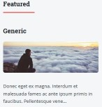

# Editorial Theme

The **Editorial** Theme is for [Grav CMS](http://github.com/getgrav/grav).  **Editorial** is a GravCMS port of the Editorial theme from HTML5Up.net.  The theme from HTML5Up.net is free for personal and commercial use under the [CCA 3.0 license](https://html5up.net/license).

## Installation

### GPM Installation (Preferred)

The simplest way to install this theme is via the [Grav Package Manager (GPM)](https://learn.getgrav.org/17/cli-console/grav-cli-gpm) through your system's terminal (also called the command line).  From the root of your Grav install type:

    bin/gpm install editorial

This will install the Editorial theme into your `/user/themes` directory within Grav. Its files can be found under `/your/site/grav/user/themes/editorial`.

### Manual Installation

To install this theme, just download the zip version of this repository and unzip it under `/your/site/grav/user/themes`. Then, rename the folder to `editorial`. You can find these files on [GitHub](https://github.com/pmoreno-rodriguez/grav-theme-editorial) or via [GetGrav.org](http://getgrav.org/downloads/themes).

### Dependencies

Although the theme does not have specific dependencies to function, **it is highly recommended to install the following plugins for a complete experience**:

- **[Archives](https://github.com/getgrav/grav-plugin-archives)** - For archive functionality
- **[Breadcrumbs](https://github.com/getgrav/grav-plugin-breadcrumbs)** - For breadcrumb navigation
- **[Feed](https://github.com/getgrav/grav-plugin-feed)** - For RSS/Atom feeds
- **[Form](https://github.com/getgrav/grav-plugin-form)** - For contact forms and form handling
- **[LangSwitcher](https://github.com/getgrav/grav-plugin-langswitcher)** - For multilingual site support
- **[Pagination](https://github.com/getgrav/grav-plugin-pagination)** - For paginated content
- **[Reading Time](https://github.com/getgrav/grav-plugin-readingtime)** - For estimated reading time display
- **[Related Pages](https://github.com/getgrav/grav-plugin-relatedpages)** - For related content suggestions
- **[Shortcode Core](https://github.com/getgrav/grav-plugin-shortcode-core)** - Core shortcode functionality
- **[SimpleSearch](https://github.com/getgrav/grav-plugin-simplesearch)** - For search functionality
- **[Taxonomy List](https://github.com/getgrav/grav-plugin-taxonomylist)** - For taxonomy-based content organization

You can install these plugins via GPM with the following command:

```bash
bin/gpm install archives breadcrumbs feed form langswitcher pagination readingtime relatedpages shortcode-core simplesearch taxonomylist
```

Or install them individually through the Grav Admin Panel.

### Post Installation

Enable the **Editorial** theme, either via the Admin plugin at admin/themes or in the system.yaml file under pages.theme.

```
pages:
  theme: editorial
```

Do not directly edit the editorial.yaml file found in the theme folder. Copy the editorial.yaml file to user/config/themes and edit the new file there.

## Theme Features

* Theme Slogan (optional) - Used to add additional text to the site name at the top of the page.
* Contact Information - Complete the form and the contact information will display in the sidebar.
* Social Icons (optional) - Add the full URL to a social platform, and an icon/link will automatically display on the top of the page.
* Blog (optional) - Blog and Item templates.
* Features module
* Banner module like the original theme.
* Contact Form module.
* Contact Form non-modular template.
* Recent Posts module - Show the latest posts in a module, eg. Home. (can be changed from twig template)
* Gallery template (with Glightbox JS)
* Custom Twig templates for SimpleSearch plugin.
* Functionality to searchbox in sidebar
* Production mode for CSS styles
* Custom logo and Custom logo mobile in theme config
* Support for Taxonomylist, Related Pages, Random, Feeds and Archives plugins.
* Team template
* Downloads template
* Shortcodes to write your pages easily, taking advantage of the styles offered by the theme.
* Custom styles for Login forms. 
* Support for navigation menu on one-page websites.
* **SEO optimization** - Built-in SEO features including meta tags, Open Graph, Twitter Cards, and JSON-LD structured data.
* **Accessibility improvements** - Semantic HTML5 landmarks for better screen reader support.
* Languages (localization): en, es, de

> [!NOTE]
> **Author Support**
>
> The theme is prepared to manage and display the author or authors of a page. To enable this functionality, you need to add `author` to the taxonomy types in your site configuration. In the Grav Admin panel, go to the **Taxonomy Types** section under **Site** tab and add `author` to the list of available taxonomies.

### Featured Pages

The featured pages tagged with the selected tag in the theme settings and the chosen number (up to a maximum of 5), will be automatically displayed in a mini-list in the sidebar with teaser images and summaries. The current page, if it appears, will not be displayed on that list.



### Blog Pages

* Add a blog page if you need it in your web. 
* Item template is ready to work the Reading Time plugin. 
* Breadcumbs plugin activated by default in posts.
* Added blog.html.twig and item.html.twig files.
* Added option to filter by author taxonomy. It is necessary to configure the author taxonomy, in the site configuration, so that the authors of the blog pages appear in them and you can use the filters by author that the theme has.
* Icons to share blog posts on social networks.
* Support for date translation if using the translate-date or twig-extensions plugins.

### Reordered assets

* All assets (css, js, sass, etc) have been reordered into **assets** folder.

### Update Styles

* All styles have been updated to latest version of the original Editorial Theme by HTML5Up.

## Default Options

Editorial comes with a few default options that can be set site-wide.  These options are:

### General Settings

```yaml
dropdown.enabled:             # Enable/Disable dropdown menu
production-mode:              # In production mode, only minified CSS is used. When disabled, nested CSS are enabled
sidebar_open:                 # Option to display the main page with the sidebar open or closed
right_sidebar:                # Enable/Disable sidebar on the right
google_fonts_local:           # Option to load Google Fonts from the theme or from Google servers
custom_css:                   # Load the custom.css file if it exists in the assets/css folder
custom_js:                    # Load the custom.js file if it exists in the assets/js folder
copyright.text:               # Set the copyright text
```

### Header Settings

```yaml
themeSlogan:                  # Custom text for slogan
favicon:                      # Choose your own favicon
custom_logo_enabled:          # Enable/Disable logo
custom_logo:                  # A custom logo rather than the default (see below)  
custom_logo_mobile:           # A custom logo to use for mobile navigation
custom_logo_width:            # Set custom width for custom logo (50-150px)
```

### SEO Settings

Editorial includes comprehensive SEO features to improve your site's search engine visibility and social media presence:

```yaml
seo.enabled:                  # Enable/Disable all SEO features
seo.json_ld_enabled:          # Enable/Disable JSON-LD structured data
seo.robots:                   # Set robots meta tag (index/follow, noindex/follow, etc.)

# Description Configuration
seo.description_length:       # Number of words for auto-generated descriptions (default: 70)
seo.description_fallback:     # Use site description as fallback if page has none
seo.description_summarization: # Method for generating descriptions ('simple' or 'smart')

# Twitter Card Settings
seo.twitter.enabled:          # Enable/Disable Twitter Card meta tags
seo.twitter.site:             # Your Twitter username (without @)
seo.twitter.card_type:        # Type of Twitter Card (summary_large_image, summary, app, player)

# Facebook Open Graph Settings
seo.facebook.enabled:         # Enable/Disable Facebook Open Graph meta tags
seo.facebook.app_id:          # Your Facebook App ID (optional)
```

The SEO features automatically generate:
- Meta descriptions from page content
- Open Graph tags for Facebook sharing
- Twitter Card tags for Twitter sharing
- JSON-LD structured data for search engines
- Canonical URLs to prevent duplicate content issues

### Sidebar Settings

```yaml
menu_langswitcher:            # Enable/Disable langswitcher icon in menu (langswitcher plugin needed)
menu_search:                  # Enable/Disable search icon in menu (simplesearch plugin needed)
menu_login:                   # Enable/Disable login icon in menu
sidebar_showtaxonomy:         # Show/Hide taxonomy section in sidebar
sidebar_showarchives:         # Show/Hide archives section in sidebar
sidebar_showrelatedpages:     # Show/Hide related pages section in sidebar
sidebar_showfeeds:            # Show/Hide feeds section in sidebar
sidebar_showrandom:           # Show/Hide random button in sidebar
```

### Blog Settings

```yaml
blog-page: '/blog'            # The route to the blog listing page, useful for a blog style layout
featured:                     # Enable/Disable featured posts in left sidebar
featured_tag:                 # Select category name for featured posts (configured in taxonomies)
featured_number:              # The number of featured posts will be displayed on the left sidebar (1-5)
```

### Contact Information

```yaml
enable_contact:               # Enable/Disable contact section
contact.text:                 # Contact section text
contact.email:                # Contact email address
contact.phone:                # Contact phone number
contact.street:               # Street address
contact.city:                 # City
contact.state:                # State/Province
contact.zip:                  # ZIP/Postal code
```

### Social Media

```yaml
social_enabled:               # Enable/Disable social icons in footer
social:                       # List of social media links
  - name:                     # Platform name
    url:                      # Full URL to your profile
    target:                   # Link target (_blank, _self, _parent, _top)
    icon:                     # Font Awesome icon name
    icon_type:                # Icon type (brands, solid, regular)
```

### Custom Menus

```yaml
custommenu_enabled:           # Enable/Disable custom menus in top menu
custommenu:                   # List of custom menu items
  - text:                     # Menu item text
    icon:                     # Font Awesome icon (optional)
    url:                      # Menu item URL
    target:                   # Link target (_blank, _self, _parent, _top)
```

To make modifications, you can copy the `user/themes/editorial/editorial.yaml` file to `user/config/themes/` folder and modify, or you can use the admin plugin.

> [!NOTE]
> Do not modify the `user/themes/editorial/editorial.yaml` file directly or your changes will be lost with any updates

## Page-Level Options

Individual pages can override theme defaults with these frontmatter options:

### Title and Display

```yaml
title:                        # Page title
subtitle:                     # Optional subtitle
show_title:                   # Show/hide page title (default: true)
page_index:                   # Show page as index/listing (default: false)
```

### Featured Image

```yaml
show_pageimage:               # Show/hide featured image (default: true)
featured_image:               # Select specific image from page media
image_width:                  # Image width in pixels (default: 1000)
image_height:                 # Image height in pixels (default: 300)
```

### SEO & Social

Each page can have its own SEO and social media settings:
```yaml
seo.robots:                   # Custom robots meta tag for this page (index/follow, noindex/follow, index/nofollow, noindex/nofollow)
seo.twitter_creator:          # Twitter username of content creator (without @, max 15 characters)
seo.image:                    # Select specific image from page media for social sharing (Open Graph & Twitter Cards)
```

These options can be set in the page's frontmatter or through the Admin Panel's page editor.

## Custom Logos

To add a custom logo, you should put the logo into the `user/themes/editorial/images/logo` folder.  Standard image formats are support (`.png`,`.jpg`, `.gif`, `.svg`, etc.).  Then reference the logo via the YAML like so:

```yaml
custom_logo:
    - name: 'my-custom-logo.png'
custom_logo_mobile:
    - name: 'my-custom-mobile-logo.png'    
```
Alternatively, you can you use the drag-n-drop "Custom Logo" field in the Editorial theme options.

## Gallery Options

| Option | Type | Default | Description |
| --- | --- | --- | --- |
| openEffect | string | `zoom` | Name of the effect on lightbox open. (zoom, fade, none) |
| closeEffect | string | `zoom` | Name of the effect on lightbox close. (zoom, fade, none) |
| slideEffect | string | `slide` | Name of the effect on slide change. (slide, fade, zoom, none) |
| moreText | string | `See more` | More text for descriptions on mobile devices. |
| moreLength | number | `60` | Number of characters to display on the description before adding the moreText link (only for mobiles), if 0 it will display the entire description. |
| closeButton | boolean | `true` | Show or hide the close button. |
| touchNavigation | boolean | `true` | Enable or disable the touch navigation (swipe). |
| touchFollowAxis | boolean | `true` | Image follow axis when dragging on mobile. |
| keyboardNavigation | boolean | `true` | Enable or disable the keyboard navigation. |
| closeOnOutsideClick | boolean | `true` | Close the lightbox when clicking outside the active slide. |
| startAt | number | `0` | Start lightbox at defined index. |
| width | number | `900px` | Default width for inline elements and iframes, you can define a specific size on each slide. You can use any unit for example 90% or 100vw for full width |
| height | number | `506px` | Default height for inline elements and iframes, you can define a specific size on each slide.You can use any unit for example 90% or 100vh **For inline elements you can set the height to auto**. |
| descPosition | string | `bottom` | Global position for slides description, you can define a specific position on each slide (bottom, top, left, right). |
| loop | boolean | `false` | Loop slides on end. |
| zoomable | boolean | `true` | Enable or disable zoomable images you can also use data-zoomable="false" on individual nodes. |
| draggable | boolean | `true` | Enable or disable mouse drag to go prev and next slide (only images and inline content), you can also use data-draggable="false" on individual nodes. |
| dragToleranceX | number | `40` | Used with draggable. Number of pixels the user has to drag to go to prev or next slide. |
| dragToleranceY | number | `65` | Used with draggable. Number of pixels the user has to drag up or down to close the lightbox (Set 0 to disable vertical drag). |
| dragAutoSnap | boolean | `false` | If true the slide will automatically change to prev/next or close if dragToleranceX or dragToleranceY is reached, otherwise it will wait till the mouse is released. |
| preload | boolean | `true` | Enable or disable preloading. | 

## Shortcodes

To view details of Editorial theme shortcodes visit this link: [Editorial theme shortcodes](https://pmoreno-rodriguez.github.io/#/./gravthemes/editorial/index?id=shortcodes)

You can view some examples of shortcodes in the demo page.

## Downloads template

Editorial theme includes a simple template to manage downloads of files uploaded to a page. These files are automatically found and processed by Grav using `page.media.all` and displayed in a table with four columns: name, size, modification date and download button.

## Demo page

[https://editorial.pmdesign.dev/](https://editorial.pmdesign.dev/)

## Documentation 

You can read extra documentation of Editorial Theme at [https://pmoreno-rodriguez.github.io/#/./gravthemes/editorial/index](https://pmoreno-rodriguez.github.io/#/./gravthemes/editorial/index). This is [Spanish document site for Editorial Theme](https://pmdesign.dev/temas/editorial)

## Future plans

* Future plans here

## Credits

* Thanks to [Jeremy Gonyea](https://github.com/jgonyea), who ported the first Editorial theme for Grav.
* This theme wouldn't be here without HTML5Up.net.  Many thanks to [AJ](mailto:aj@lkn.io) for creating the theme initially on that site.
* Demo images came from [Unsplash](https://unsplash.com/es/@freys/)

## ☕ Support This Project
If you find this project useful and would like to support its development,
you can buy me a coffee on Ko-fi:

👉 **[Support me on Ko-fi](https://ko-fi.com/pmoreno)**

Thank you for supporting open-source software! 🙌
