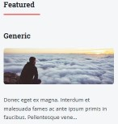

# Editorial Theme

The **Editorial** Theme is for [Grav CMS](http://github.com/getgrav/grav).  **Editorial** is a GravCMS port of the Editorial theme from HTML5Up.net.  The theme from HTML5Up.net is free for personal and commercial use under the [CCA 3.0 license](html5up.net/license).

## Installation
### GPM Installation (Preferred)

The simplest way to install this theme is via the [Grav Package Manager (GPM)](http://learn.getgrav.org/advanced/grav-gpm) through your system's terminal (also called the command line).  From the root of your Grav install type:

    bin/gpm install editorial

This will install the Editorial theme into your `/user/themes` directory within Grav. Its files can be found under `/your/site/grav/user/themes/editorial`.

### Manual Installation

To install this theme, just download the zip version of this repository and unzip it under `/your/site/grav/user/themes`. Then, rename the folder to `editorial`. You can find these files on [GitHub](https://github.com/jgonyea/grav-theme-editorial) or via [GetGrav.org](http://getgrav.org/downloads/themes).

### Post Installation
Enable the **Editorial** theme, either via the Admin plugin at admin/themes or in the system.yaml file under pages.theme.
```
pages:
  theme: editorial
```

Do not directly edit the editorial.yaml file found in the theme folder. Copy the editorial.yaml file to user/config/themes and edit the new file there.

## Features

* Theme Slogan (optional) - Used to add additional text to the site name at the top of the page.
* Contact Information - Complete the form and the contact information will display in the sidebar.
* Social Icons (optional) - Add the full URL to a social platform, and an icon/link will automatically display on the top of the page.
* Blog (optional) - Blog and Item templates.
* Contact Form - Modular contact form template included


### Featured Pages
The latest three ~~pages~~ posts from blog tagged with the category "featured" will automatically display in a mini-listing in the sidebar with teaser images and summaries.  The current page, if featured, will not display in that listing.



### Blog Pages

* Add a blog page if you need it in your web. 
* Item template is ready to work the Reading Time plugin. 
* Added blog.html.twig and item.html.twig files.


## Future plans
* ~~Add a page for all featured pages.~~
* Readd the older IE stylesheets/ js.
* Instructions for editing sass files.

## Credits
* This theme wouldn't be here without HTML5Up.net.  Many thanks to [AJ](aj@lkn.io) for creating the theme initially on that site.
* Demo images came from [Unsplash](https://unsplash.com/)
